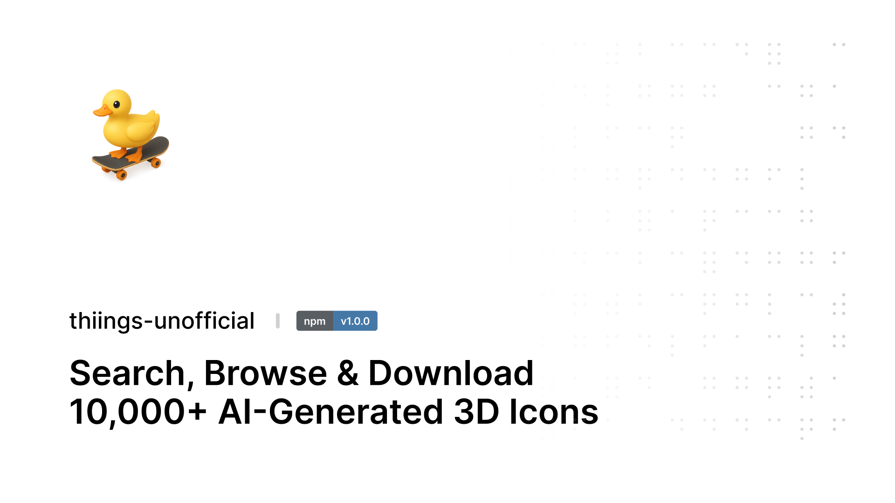

<picture>
  <source media="(prefers-color-scheme: dark)" srcset="assets/banner-dark-v2.png">
  <source media="(prefers-color-scheme: light)" srcset="assets/banner-light.png">
  
</picture>

# thiings-unofficial

[](https://www.npmjs.com/package/thiings-unofficial)

Unofficial MCP server and CLI for [thiings.co](https://www.thiings.co/things). Search, browse, and download 10,000+ AI-generated 3D icons from your terminal or any MCP client.

The icon collection is built by [Clerk Charlie](https://x.com/clarkcharlie03) and lives at [thiings.co](https://www.thiings.co/things). This project is not affiliated with or endorsed by thiings.co. It gives you programmatic access to the public collection.

## Install

```bash
npm install -g thiings-unofficial
```

Or run without installing:

```bash
npx thiings-unofficial
```

## CLI

Run `thiings` to launch the interactive menu:

```
  thiings  —  10,000+ AI-generated 3D icons
  https://www.thiings.co

? What would you like to do?
❯ Search icons
  Browse icons
  View icon details
  Download icons
  List categories
  Manage cache
  Exit
```

Pick an option and follow the prompts. Search results show the URL for each icon and a link to view all results on thiings.co. You can drill into details, download one icon, or batch download everything.

## MCP Server

### Claude Code

```bash
claude mcp add thiings npx thiings-mcp
```

### Claude Desktop

Edit `~/Library/Application Support/Claude/claude_desktop_config.json`:

```json
{
  "mcpServers": {
    "thiings": {
      "command": "npx",
      "args": ["thiings-mcp"]
    }
  }
}
```

### From source

```bash
git clone https://github.com/realsamrat/thiings-unofficial.git
cd thiings-unofficial
npm install && npm run build
claude mcp add thiings node /absolute/path/to/thiings-unofficial/build/mcp/server.js
```

### Available tools

| Tool | What it does |
|------|-------------|
| `search_icons` | Search by name, keyword, or category. Returns id, name, categories, image URL, and page URL for each icon. Also returns a `searchUrl` to view results on thiings.co. |
| `get_icon` | Full details for one icon including description, categories, and page URL. |
| `list_categories` | All 501 categories with icon counts and browse URLs. |
| `browse_icons` | Paginated browsing with optional category filter. Each icon includes its page URL. |
| `download_icon` | Download a single PNG to disk. |
| `download_icons` | Batch download by query, category, or explicit list of IDs. |

### Resources

| URI | Content |
|-----|---------|
| `thiings://catalog` | Full cached icon index (JSON) |
| `thiings://icon/{id}` | Single icon with description (JSON) |

## How it works

thiings.co is a Next.js app. The catalog page embeds all 10,000 icons as serialized React Server Component data. The scraper extracts that payload, unescapes it, and parses the JSON array. Individual icon pages contain descriptions in the same RSC format, split across multiple script chunks.

Images are served from Vercel Blob Storage as 1024x1024 RGBA PNGs.

The local cache at `~/.thiings/cache.json` stores the full catalog for 24 hours before refreshing. As the collection grows beyond 10,000 icons, the cache picks up new additions on the next refresh.

## Project structure

```
src/
  core/
    types.ts        # Shared types (Icon, IconDetail, SearchResult)
    scraper.ts      # Fetches and parses thiings.co pages
    cache.ts        # Local JSON cache (~/.thiings/cache.json, 24h TTL)
    search.ts       # Scored search over name + categories
    downloader.ts   # Single and batch PNG downloads
  mcp/
    server.ts       # MCP server (6 tools, 2 resources, stdio transport)
  cli/
    index.ts        # Interactive CLI with inquirer
```

## Tech

- TypeScript, Node.js
- [@modelcontextprotocol/sdk](https://www.npmjs.com/package/@modelcontextprotocol/sdk) for the MCP server
- [@inquirer/prompts](https://www.npmjs.com/package/@inquirer/prompts) for the interactive CLI
- [chalk](https://www.npmjs.com/package/chalk) for terminal colors
- [zod](https://www.npmjs.com/package/zod) for input validation
- No heavy dependencies. Regex-based parsing instead of cheerio.

## Contributing

Want to help? Read [CONTRIBUTING.md](CONTRIBUTING.md) first.

The short version: fork the repo, make a branch, change something in `src/`, run `npm run build`, test it, open a PR. One concern per PR. If the scraper broke because thiings.co changed their page structure, that's a common fix and we'll merge it fast.

Bug reports go in [Issues](https://github.com/realsamrat/thiings-unofficial/issues). Include what you ran, what you expected, and what happened.

## Disclaimer

This is an unofficial, community-built tool. It is not created, maintained, or endorsed by thiings.co or Clerk Charlie. All icons are the property of their respective creators. Use responsibly.

## License

MIT
